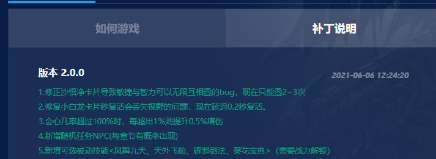
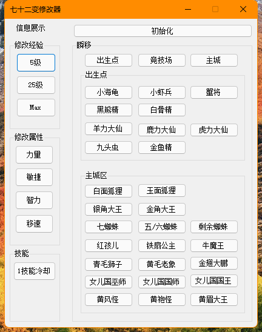

# war3-72bian
War3-官方对战平台RPG地图-七十二变之斩妖除魔 修改器

## 开发环境

Winform 

.Net Framework 4.8 (也可以改为其他版本)

VisualStudio 2022

## 使用方法

选择角色后, 点击软件中相应的功能即可, 

`注意: 先点击 等级5和25 解锁技能, 技能解锁后 , 再点击Max `

# 技巧

选择`仙子`(火德也行), 先把 力量,智力加满,  

到商店转一下属性值, 触发血量更新,  

瞬移到`小海龟`, 升到255级, 点击 `一技能冷却`

顺序瞬移秒boss即可,  1分钟一局

## 游戏版本:

War3版本:  `1.27.0.52240`

地图版本: `2.0.0`

## 截图

