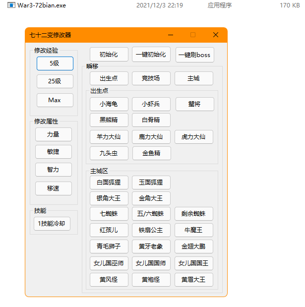

# war3-72bian
War3-官方对战平台RPG地图-七十二变之斩妖除魔 修改器

## 开发环境

.Net 8

Winform

VisualStudio 2022

# 使用方法

游戏设置成`窗口模式` > `1366x768`, 视角距离 选择`默认`

手动创建个房间, 

点击 `一键刷boss` 

自动无限刷, 每天轻轻松松150个宝箱

# 自己编译

右击项目,选择  发布 > 文件夹.

**设置 :**

目标运行时:`win-86`  (只有32位程序才能读取32位的游戏内存)

勾选`生成单个文件`

## 游戏版本:

War3版本:  `1.27.0.52240`

地图版本: `2.0.0`

## 截图

